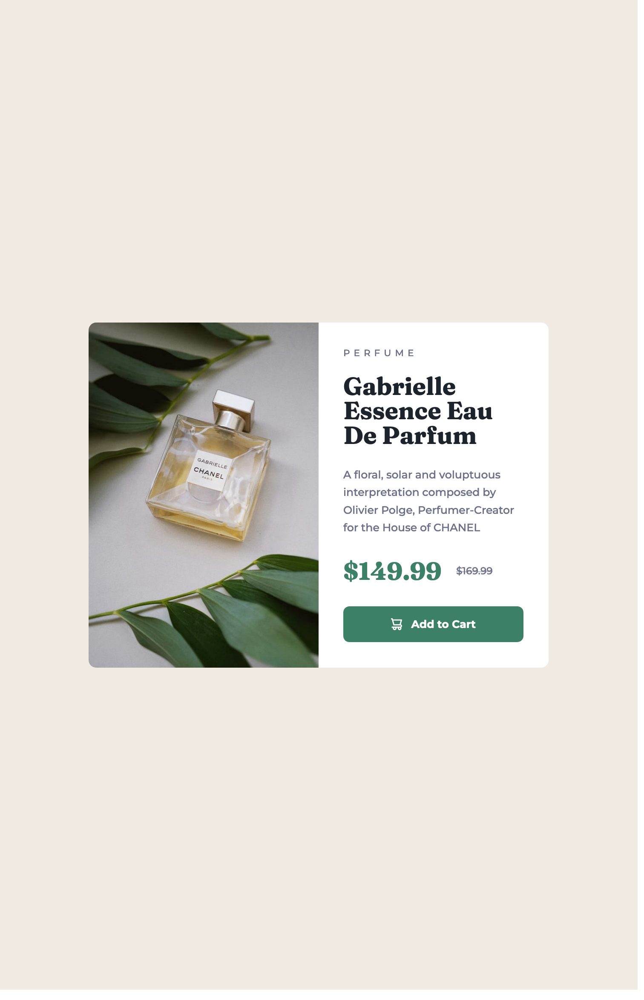

# Frontend Mentor - Product preview card component solution

This is a solution to the [Product preview card component challenge on Frontend Mentor](https://www.frontendmentor.io/challenges/product-preview-card-component-GO7UmttRfa). Frontend Mentor challenges help you improve your coding skills by building realistic projects. 

## Table of contents

- [Overview](#overview)
  - [The challenge](#the-challenge)
  - [Screenshot](#screenshot)
  - [Links](#links)
- [My process](#my-process)
  - [Built with](#built-with)
  - [What I learned](#what-i-learned)
  - [Continued development](#continued-development)
  - [Useful resources](#useful-resources)
- [Author](#author)
- [Acknowledgments](#acknowledgments)

## Overview

### The challenge

Users should be able to:

- View the optimal layout depending on their device's screen size
- See hover and focus states for interactive elements

### Screenshot

### Links

- Solution URL: [Github](https://github.com/kwonmoon/product-preview-card-component)
- Live Site URL: [Netlify]()

## My process

### Built with

- Semantic HTML5 markup
- CSS custom properties
- Flexbox
- SASS

### What I learned

- I decided to use sass to build this project. It was my first time trying sass. I might have made some mistakes in my sass, nonethless the outcome looks great.

### Continued development

- From now on, I think I am going to use sass.

### Useful resources

- [Sass and BEM for biginners](https://www.youtube.com/watch?v=jfMHA8SqUL4) - This helped me to learn sass quickly. Her demo for building a project with sass looks great. It's not like toy tutorials. I got working knowledge by watching her Youtube.

## Author

- Frontend Mentor - [@kwonmoon](https://www.frontendmentor.io/profile/kwonmoon)

## Acknowledgments

- Coder Coder Youtube channel: https://www.youtube.com/@TheCoderCoder